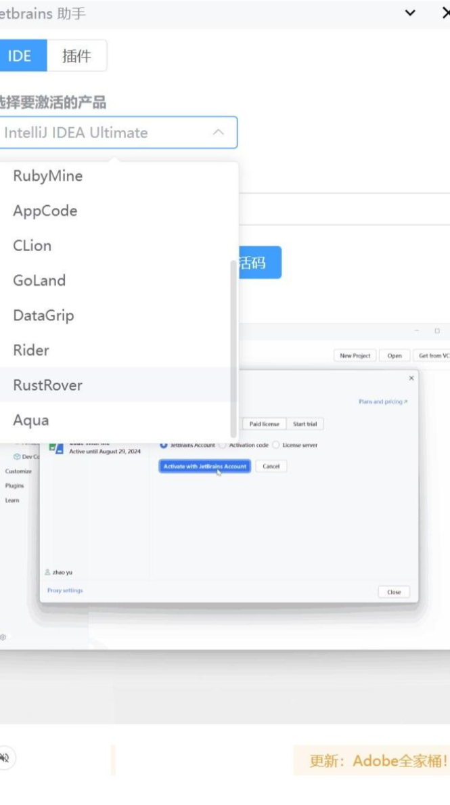
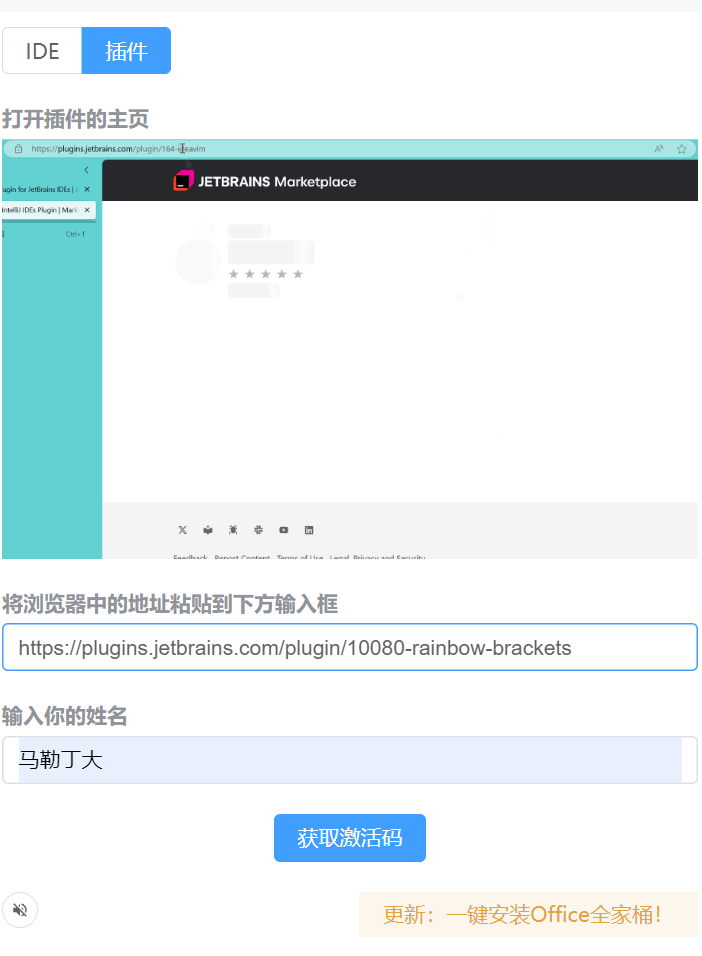
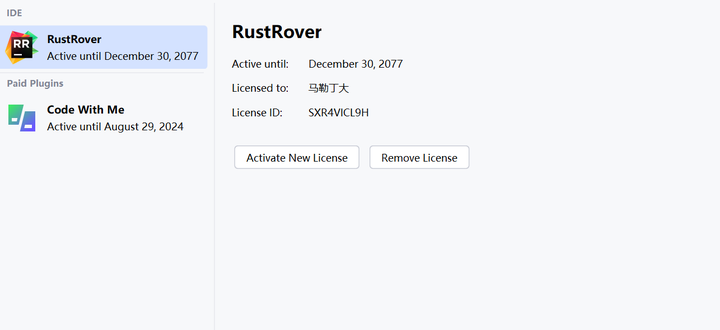

# Jetbrains 全家桶激活

支持任一IDE，支持任选插件，支持用你喜欢的名字激活。

## 服务状态
服务正常的时候，本工具才可用。否则[请提 issue](https://github.com/toolsshare/website/issues)给我。

<iframe src="https://stats.uptimerobot.com/wiQ335FbNE" width='100%'></iframe>

## 激活步骤
1. 下载各种IDE： https://www.jetbrains.com/ides/ 
2. 如果之前曾经激活过，需要清空原来的激活信息，特别是需要将系统变量中 VM_OPTIONS 结尾的都删掉
   ```text
   RUSTROVER_VM_OPTIONS
   IDEA_VM_OPTIONS
   CLION_VM_OPTIONS
   PHPSTORM_VM_OPTIONS
   GOLAND_VM_OPTIONS
   PYCHARM_VM_OPTIONS
   WEBSTORM_VM_OPTIONS
   WEBIDE_VM_OPTIONS
   RIDER_VM_OPTIONS
   DATAGRIP_VM_OPTIONS
   RUBYMINE_VM_OPTIONS
   APPCODE_VM_OPTIONS
   DATASPELL_VM_OPTIONS
   GATEWAY_VM_OPTIONS
   JETBRAINS_CLIENT_VM_OPTIONS
   JETBRAINSCLIENT_VM_OPTIONS
   STUDIO_VM_OPTIONS
   DEVECOSTUDIO_VM_OPTIONS
   ```
3. 下载jetbrains 助手，并打开

   |下载地址 |下载地址 |
   |--|--|
   |线路1|[gitee](https://gitee.com/elite-united/app-release/releases)|
   |线路2|[onedrive](https://onedrive.live.com/?id=C54A6E330F5731A4!66493&resid=C54A6E330F5731A4!66493&authkey=!AJGDid1z-bvzukM&cid=c54a6e330f5731a4)|
   |线路3|[微云](https://share.weiyun.com/pQjuATsL)|
   |线路4|[123网盘](https://www.123pan.com/s/4MuNjv-Q8Ahh.html) |


### 激活 IDE


### 激活插件




