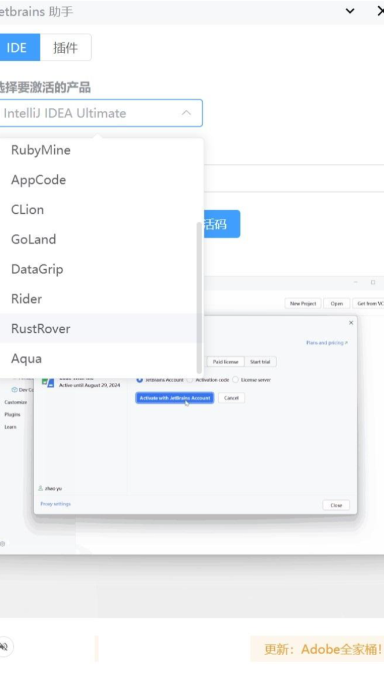
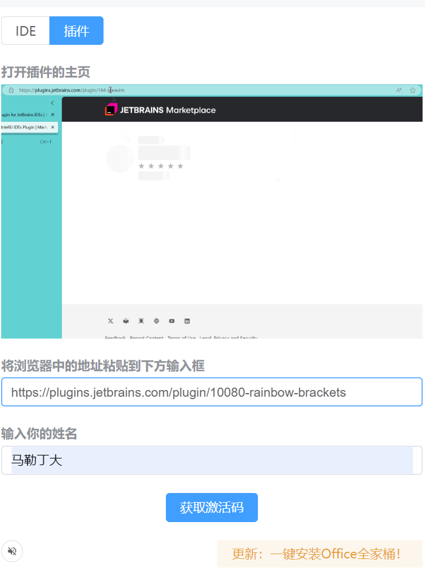

支持任一IDE，支持任选插件，支持用你喜欢的名字激活，全网唯一。

## 服务状态
服务正常的时候，本工具才可用。否则[请提 issue](https://github.com/toolsshare/website/issues)给我。

点此[查看服务状态](https://stats.uptimerobot.com/wiQ335FbNE)

## 激活步骤
1. 下载各种IDE： https://www.jetbrains.com/ides/ 
2. 如果之前曾经激活过，需要清空原来的激活信息，特别是需要将系统变量中 VM_OPTIONS 结尾的都删掉
   ```text
   RUSTROVER_VM_OPTIONS
   IDEA_VM_OPTIONS
   CLION_VM_OPTIONS
   PHPSTORM_VM_OPTIONS
   GOLAND_VM_OPTIONS
   PYCHARM_VM_OPTIONS
   WEBSTORM_VM_OPTIONS
   WEBIDE_VM_OPTIONS
   RIDER_VM_OPTIONS
   DATAGRIP_VM_OPTIONS
   RUBYMINE_VM_OPTIONS
   APPCODE_VM_OPTIONS
   DATASPELL_VM_OPTIONS
   GATEWAY_VM_OPTIONS
   JETBRAINS_CLIENT_VM_OPTIONS
   JETBRAINSCLIENT_VM_OPTIONS
   STUDIO_VM_OPTIONS
   DEVECOSTUDIO_VM_OPTIONS
   ```
3. 下载[交流电软件银行](/download)，在软件里搜索 `jetbrain`，会自动安装激活工具到你选择的下载目录，并自动打开 `jetbrains 助手` 激活全家桶

更多使用指南参考：
> [交流电软件银行使用指南](https://krnue5wdel.feishu.cn/wiki/PQZzw3f1dievv0kQDPScQbkpnpe?from=from_copylink)
> [Jetbrains 助手使用指南](https://krnue5wdel.feishu.cn/wiki/EfnIw5JqAibU0TkNhHFcqWEInDg?from=from_copylink)

### 激活 IDE


### 激活插件



