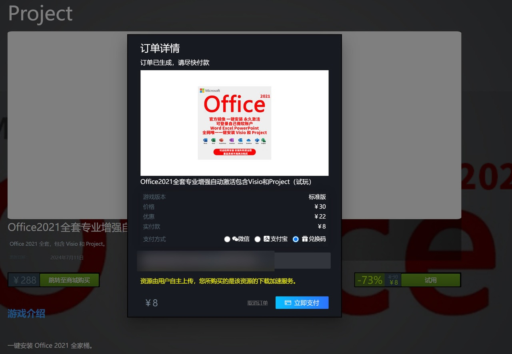
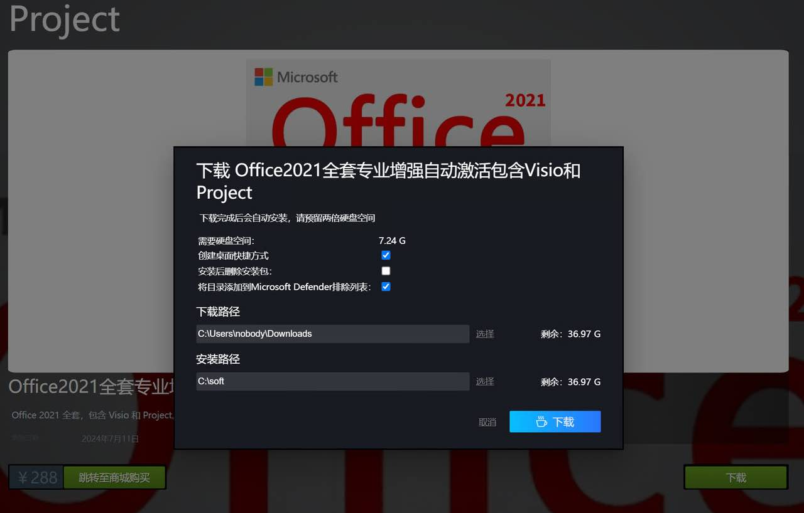

软件下载及用户注册详见 [AC SoftBank 使用指南](/download)。

## 兑换或购买
一次下载，永久激活，更换设备不受影响。



:::info
1. 选择标题包含 Visio 和 Project 的，将会自动安装这两个软件并激活
2. 建议选择`Office 365`版本，365版本功能比所有年份版都多
3. Office 365 版本没有 1T 云盘空间
:::

## 下载（约5分钟）

:::warning
* 如果你之前安装了Office，建议先卸载。
* 如果你之前安装了32位版本的Office，且希望更换成64位（非科学计算场景，32位、64位没区别），你一定要执行这些卸载操作，不然安装完成后，还是32位。如果不幸你已经安装好了，请看这个链接，更换32位为64位：Office 安装、使用、卸载合集
* 新系统默认安装64位
:::


### 选择下载路径
此处的安装路径，不是最终Office安装路径，而是压缩包的解压路径，所以你随便选择一个有空间的地方就行了。最终Office将会安装到 C:\Program Files\Microsoft Office\。



点击下载后，点击底部进度条，查看下载进度。

## 安装

下载完成后，将会自动执行安装和激活。该过程将会持续约5-10分钟，期间将会弹出黑色命令行窗口，不用操作，等待完成即可。

## 卸载
在 Win11 的`系统设置-应用-安装`的应用中，找到 Project、Visio 和 Office 分别卸载即可。

注意卸载前关闭所有 Office 软件，否则卸载不掉。

## 手动激活
如果你在下载完成后，激活失败，可以尝试如下命令，手动激活：
```
.\activate.bat 2021         ## 激活版本 Office 2021
.\remove_all_keys.bat       ## 清除所有 key，慎用
.\remove_default_keys.bat   ## 清除 2016
```

## FAQ
1. 为什么通过 cscript ospp.vbs /dstatus 查看是还是有过期时间（grace period）的？
无视即可。Ohook不修改你任何东西，只是告诉 Office 它自己激活了。即使 key 过期了，Office 还是激活的，这点跟 KMS 是不一样的，也更省心。

2. Office 可以指定安装到其它盘吗？
不可以，必须安装到 C 盘。

3. 可以更新吗？是永久激活码？
可以更新，是永久激活，无180天限制。

> https://krnue5wdel.feishu.cn/wiki/Jcaywjgp7iyYc2ksfoJckSWHnnb?from=from_copylink

